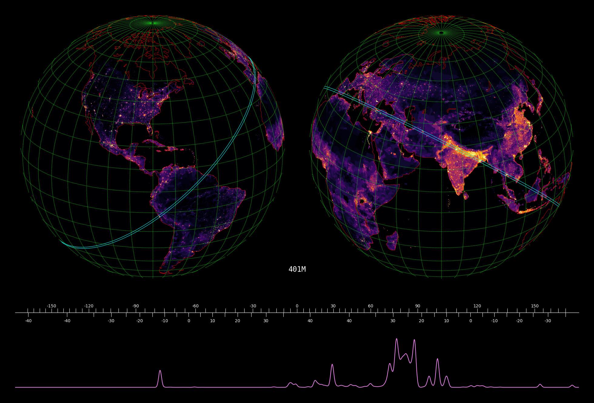

the goal of this project is to find the most densely populated great
circle. a great circle on a sphere is a circle with the same radius as
the sphere.

practically, we can imagine a 100km wide "great ring", so that anyone
living within 50km of the great circle is counted.

data source: http://sedac.ciesin.columbia.edu/data/collection/gpw-v4/sets/browse

